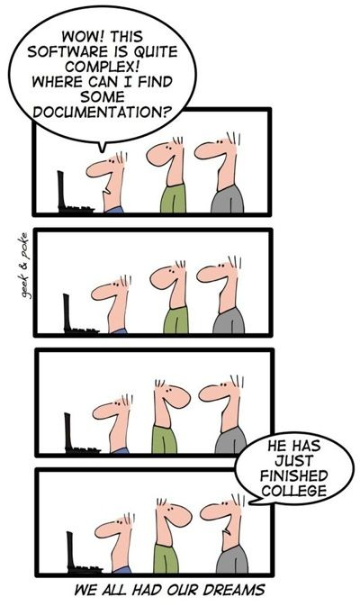

# Les boulangers
Projet pour le cours d'AMT à la HEIG-VD

## Description
Boutique en ligne de boulangerie et pâtisserie.

// TODO DPO - Trop bien d'avoir mis la version java ! 
## Pré-requis
- Postgresql (v13 ou supérieur)
- Java 11

> TODO DPO - Comment dire...le readme est...concis. Peut-être un peu trop. J'ai passé 15 min à essayer de lancer un 
environnement en local pour recevoir un 404...je me suis donc arrêter là. 
> Je vous invite à ajouter une section qui indique comment configurez le projet dans un environnement local (db également)
> Conseil d'expérience: c'est aussi assez cool de voir à quoi ressemble l'app. Hésitez pas à mettre un petit screenshot ou encore mieux, un petit gif de votre app dans la description
> J'ai également écris quelques commentaires dans votre code et dans votre wiki (je n'ai pas reverifié, mais je pense que l'un d'eux est lié 
> au fait que ça ne fonctionnait pas chez moi)
> Je vous ferais un retour en review également dès que possible
> Bonne lecture et bravo pour l'avancement.

## Déploiement
Télécharger la release et l'extraire. Ajouter les données de connection à la base de données dans le fichier `.env`.
Lancer le serveur avec `java -jar target/quarkus-app/quarkus-run.jar`

## Installation
Cloner le repository. Pour lancer la base de donnée en local, effectuer un `docker-compose up` dans le dossier `docker`. 
Pour compiler l'application, utiliser `mvn compile quarkus:dev:`. Il faut également indiquer les informations de connexions pour la base de donnée dans le fichier `config/application.properties`. L'utilisateur et le mot de passe par défaut est `amt`.

## Contribution
Les Pull Requests sont les bienvenues. Pour des changements majeurs, ouvrez s'il vous plaît une issue pour discuter de ce que vous souhaitez changer.
Soyez sûrs de mettre à jour les tests si nécessaire.

## Licence
[MIT](https://choosealicense.com/licenses/mit/)

## Auteurs
- Léonard Besseau
- Alexandra Cerottini
- Miguel Do Vale Lopes
- Fiona Gamboni
- Nicolas Ogi
